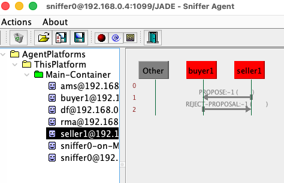
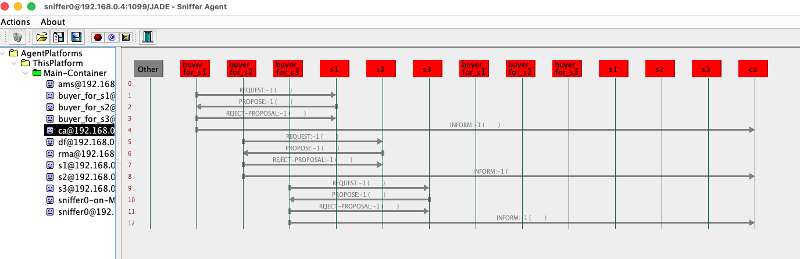
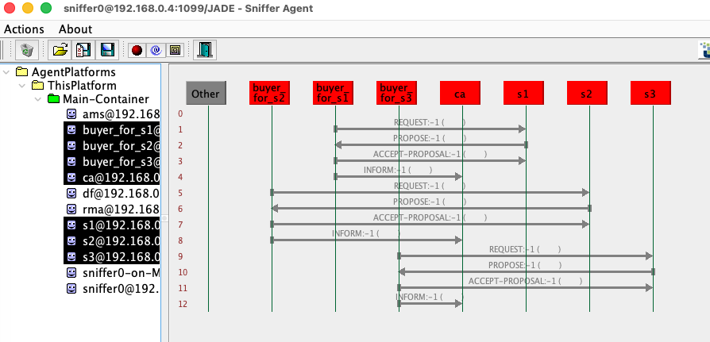
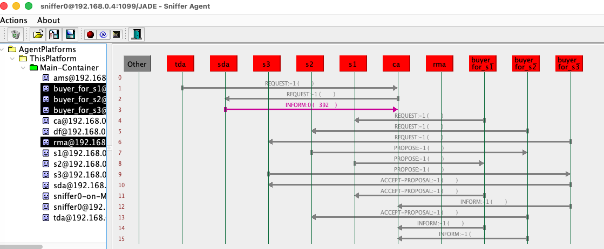
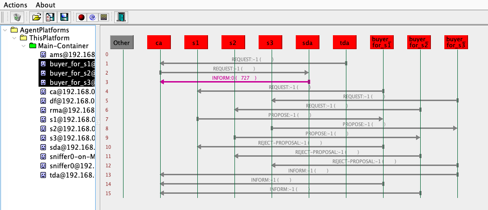

# Fase 0

- Configuração do JADE: colocando o jade.jar na lib/.
- Criando um agente de teste: DummyAgent com código "Hello world"
- Configuração do .vscode/launch.json para execução no VS code.

# Fase 1

- Construir o vocabulario NegotiationIssue -> ProductBundle -> Bid -> Proposal
- ```NegotiationIssue.java```: critérios (issue) de negociação.
- ```ProductBundle.java```: pacote de produtos. 
- ```Bid.java```: um lance (Bid) para um pacote de produtos específico.
- ```Proposal.java```: proposta (ou contraproposta) com um conjunto de Bids.
- Teste com uma classe temporaria Main.java instanciando um bid

# Fase 2

- Instalação e configuração do Maven
- EvaluationService.java: Implementação das eq. 1-4 do artigo
    - Teoria da Utilidade Multi-Atributo (MAUT)
    - calculateUtility(): Função de Utilidade do Bid (Equação 4)
    - normalizeQualitativeUtility(): Normalização com Números Fuzzy Triangulares (Equação 3)
    - normalizeQuantitativeUtility(): Funções de Utilidade Não-Lineares (Equações 1 e 2)
- Teste unitário usando Junit

# Fase 3

- BuyerAgent e um SellerAgent trocarem mensagens e realizarem uma negociação rudimentar
- SA: O SellerAgent inicia enviando uma mensagem contendo um objeto Proposal
- BA: O BuyerAgent responde com uma contraproposta (ACLMessage.PROPOSE) ou com um ACLMessage.ACCEPT_PROPOSAL.

<center>



</center>

# Fase 4

- Introduzir o CoordinatorAgent para gerenciar múltiplas negociações paralelas
- CA: cria um Agente Comprador (BA) para cada fornecedor, controlando as interações e, ao final, seleciona os fornecedores vencedores com base nos resultados
- SA: alterado de proativo para reativo
- BA: envia uma mensagem REQUEST ("Call for Proposal") para o Vendedor que lhe foi designado

<center>



</center>

# Fase 5

V1
- WinnerDeterminationService.java: lógica para resolver o (WDP - Winner Determination Problem) em "brute force"
- NegotiationResult.java: encapsular o resultado de cada negociação

v2
-  WinnerDeterminationService.java: implementação do algoritmo Branch-and-Bound (B&B) 

<center>



</center>

# Fase 6

- TaskDecomposerAgent.java: informar ao CoordinatorAgent (CA) quais produtos precisam ser comprados
- SynergyDeterminationAgent.java: recebe uma lista de produtos do CA e retorna os "pacotes de produtos" (product bundles) preferidos
- CA: refatorado para ser reativo, espera pela requisição do TDA, consulta o SDA, e só então começa a orquestração

<center>



</center>

# Fase 7

- ConfigLoader.java: Singleton para configuração dos agentes pelo config.properties

<center>



</center>